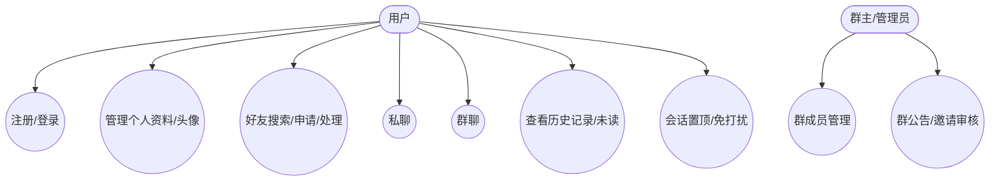
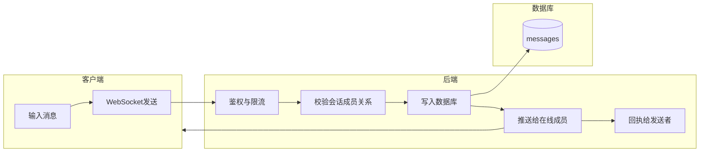
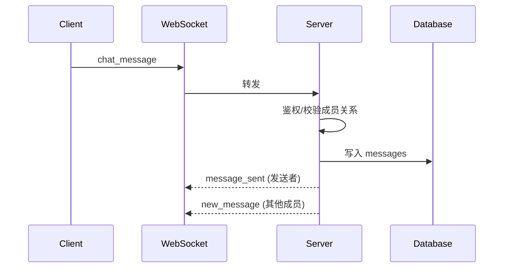
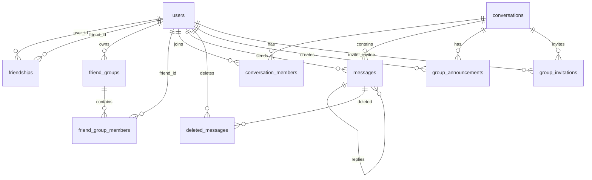

# 即时通讯系统（IM）API 与设计文档

> 适用范围：本仓库的 `frontend/` 与 `backend/`。文档面向后续维护与二次开发人员。

## 1. 项目概述
本项目为类似 iMessage 的即时通讯系统，提供用户管理、好友系统、私聊/群聊、消息实时投递与可靠存储能力，并支持 Web 端 UI（会话列表 + 聊天窗口）。

## 2. 需求分析

### 2.1 用户故事
- 作为新用户，我可以注册账号并登录，以便开始使用聊天功能。
- 作为用户，我可以搜索其他用户并发送好友申请，建立双向好友关系。
- 作为用户，我可以创建私聊或群聊，并进行文本消息发送与回复。
- 作为用户，我可以查看会话未读数量、历史记录并筛选消息。
- 作为群主/管理员，我可以管理群成员、发布公告、审核入群邀请。
- 作为用户，我可以设置会话置顶或免打扰，并能删除本地消息记录。

### 2.2 关键质量属性
- **可用性**：Web 端界面完整可用，前后端可通信。
- **安全性**：密码使用哈希保存；API 使用 JWT 鉴权；WebSocket 校验 token 与 Origin。
- **实时性**：WebSocket 进行消息实时推送与状态同步。
- **数据完整性**：消息持久化入库；已读位置、软删除记录可追溯。

### 2.3 用例图（示意）


### 2.4 业务流程泳道图（发送消息）


## 3. 模块与架构说明

### 3.1 后端模块
- **auth**：注册/登录/注销、用户信息维护、头像上传。
- **friends**：好友申请、好友列表、好友分组管理。
- **conversations**：
  - listing：会话列表、历史消息拉取、已读位置更新、创建会话。
  - management：删除消息/清空消息、会话置顶/免打扰、隐藏会话窗口。
  - group：群信息、公告、成员管理、邀请审核、退群。
- **websocket**：消息实时收发、已读回执、输入状态、离线消息推送。
- **core/db/models**：安全、依赖注入、数据模型与数据库初始化。

### 3.2 前端模块
- **Auth 页面**：注册、登录、个人资料编辑、头像上传。
- **好友列表/分组**：好友搜索、好友申请与分组维护。
- **聊天模块**：会话列表、聊天窗口、消息发送、群管理 UI。
- **Redux Store**：用户登录态与 token 管理。
- **Network Wrapper**：统一 REST 请求与错误处理。

## 4. API 文档

### 4.1 通用约定
- **REST Base URL**：`/api`（部署时通常由网关或 Next.js rewrite 转发）
- **鉴权**：请求头 Authorization 值为 B​earer + 空格 + <access_token>（`/auth/login` 返回 token_type=bearer）
- **时间字段**：ISO 8601 字符串
- **错误响应**：HTTP 状态码 + `detail` 或 `message` 字段

### 4.2 Auth 接口

| 方法 | 路径 | 说明 | 鉴权 |
|---|---|---|---|
| POST | `/auth/register` | 注册用户 | 否 |
| POST | `/auth/login` | 登录获取 token | 否 |
| POST | `/auth/logout` | 登出 | 是 |
| GET | `/auth/me` | 获取当前用户信息 | 是 |
| PUT | `/auth/profile` | 更新资料（含密码/邮箱等） | 是 |
| POST | `/auth/avatar` | 上传头像（multipart） | 是 |
| DELETE | `/auth/delete_account` | 注销账号（软删除） | 是 |

**/auth/register**  
请求体（JSON）：
```json
{
  "username": "alice_01",
  "password": "abc12345",
  "email": "alice@example.com",
  "phone": "13800000000",
  "nickname": "Alice"
}
```
响应：`UserResponse`

**/auth/login**  
请求体：
```json
{ "username": "alice_01", "password": "abc12345" }
```
响应：
```json
{ "access_token": "jwt", "token_type": "bearer" }
```

**/auth/profile**  
请求体：`UserUpdate`（敏感字段需 `current_password`）

**/auth/avatar**  
`multipart/form-data`，字段名 `file`

### 4.3 好友与分组接口

| 方法 | 路径 | 说明 | 鉴权 |
|---|---|---|---|
| GET | `/friends/search?keyword=...` | 搜索用户 | 是 |
| POST | `/friends/request/{friend_id}` | 发送好友申请 | 是 |
| PUT | `/friends/accept/{request_id}` | 同意好友申请 | 是 |
| GET | `/friends/list?status=&type=` | 获取好友列表 | 是 |
| DELETE | `/friends/{friendship_id}` | 删除/拒绝好友关系 | 是 |
| POST | `/friends/groups?group_name=...` | 创建好友分组 | 是 |
| GET | `/friends/groups` | 获取好友分组 | 是 |
| PUT | `/friends/groups/{group_id}?group_name=...` | 更新好友分组 | 是 |
| DELETE | `/friends/groups/{group_id}` | 删除好友分组 | 是 |
| POST | `/friends/groups/{group_id}/members/{friend_id}` | 添加好友到分组 | 是 |
| DELETE | `/friends/groups/{group_id}/members/{friend_id}` | 移出好友分组 | 是 |
| GET | `/friends/groups/{group_id}/members` | 获取分组成员 | 是 |

参数说明：
- `status`：`pending/accepted/blocked/all`（默认 `accepted`）
- `type`：`sent/received/all`（默认 `all`）

### 4.4 会话与消息接口

| 方法 | 路径 | 说明 | 鉴权 |
|---|---|---|---|
| GET | `/conversations/list` | 获取会话列表 | 是 |
| POST | `/conversations/create` | 创建私聊/群聊 | 是 |
| GET | `/conversations/{id}/messages` | 拉取消息记录 | 是 |
| PUT | `/conversations/{id}/read` | 更新已读位置 | 是 |
| PATCH | `/conversations/{id}/settings` | 置顶/免打扰 | 是 |
| DELETE | `/conversations/{id}` | 隐藏会话窗口 | 是 |
| DELETE | `/conversations/{id}/messages/{msg_id}` | 删除单条消息 | 是 |
| DELETE | `/conversations/{id}/messages` | 清空会话消息 | 是 |

**/conversations/create**  
请求体：
```json
{
  "type": "private",
  "target_user_id": 2
}
```
或群聊：
```json
{
  "type": "group",
  "group_name": "项目讨论",
  "member_ids": [2, 3]
}
```
响应：`CreateConversationResponse`

**/conversations/{id}/messages**  
查询参数（可选）：`limit`、`before_msg_id`、`start_time`、`end_time`、`sender_id`

### 4.5 群聊管理接口

| 方法 | 路径 | 说明 | 鉴权 |
|---|---|---|---|
| GET | `/conversations/{id}/group-info` | 群信息（成员/公告） | 是 |
| GET | `/conversations/{id}/announcements` | 公告列表 | 是 |
| POST | `/conversations/{id}/announcements` | 发布公告 | 是（群主/管理员） |
| PATCH | `/conversations/{id}/members/{uid}/role` | 修改成员角色 | 是（群主） |
| DELETE | `/conversations/{id}/members/{uid}` | 移除群成员 | 是（群主/管理员） |
| POST | `/conversations/{id}/invites` | 邀请好友入群 | 是 |
| GET | `/conversations/{id}/invites?status=` | 邀请列表 | 是（群主/管理员） |
| PUT | `/conversations/{id}/invites/{inv_id}/review` | 审核邀请 | 是（群主/管理员） |
| DELETE | `/conversations/{id}/leave` | 退出群聊 | 是 |

### 4.6 WebSocket 接口

**连接地址**  
`/ws/chat?token=<jwt>`（生产环境使用 `wss://`）

**客户端发送消息格式**
```json
{ "type": "chat_message", "data": { "conversation_id": 1, "content": "hi", "msg_type": "text", "reply_to": 10, "temp_id": 123 } }
```
支持类型：
- `chat_message`：发送消息
- `read_receipt`：更新已读 `{conversation_id, last_read_msg_id}`
- `typing`：输入状态 `{conversation_id, is_typing}`
- `ping`：心跳

**服务端推送类型**
- `new_message`：新消息广播
- `message_sent`：发送者确认
- `offline_messages`：离线补发
- `typing_status`：输入状态
- `group_announcement`：公告推送
- `new_conversation`：新会话通知
- `role_changed`：群成员角色变更
- `member_change`：群成员列表变更
- `member_removed`：群成员被移除（当前服务端事件名为 `MEMBER_REMOVED`，客户端需兼容该名称）
- `error` / `pong`

### 4.7 消息发送序列图


## 5. 数据库设计

### 5.1 表清单
- `users`：用户账户、邮箱、手机号、头像、激活状态
- `friendships`：好友关系与状态（pending/accepted/blocked）
- `friend_groups`：好友分组
- `friend_group_members`：好友-分组关联
- `conversations`：会话（private/group）
- `conversation_members`：会话成员、角色、已读位置、置顶/免打扰
- `messages`：消息内容、类型、回复关系
- `deleted_messages`：用户级消息软删除记录
- `group_announcements`：群公告
- `group_invitations`：群邀请及审核状态

### 5.2 ER 图


### 5.3 关键字段说明
- `users.is_active`：软删除标记，注销后禁止登录/发送消息。
- `conversation_members.read_msg_id`：每个用户的已读位置，用于未读数统计。
- `messages.reply_to`：消息回复关联，用于“回复链条”展示。
- `deleted_messages`：每用户的软删除记录，不影响其他成员。
